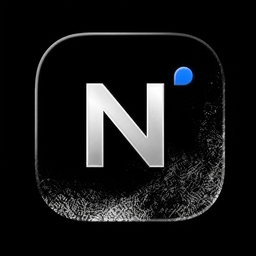
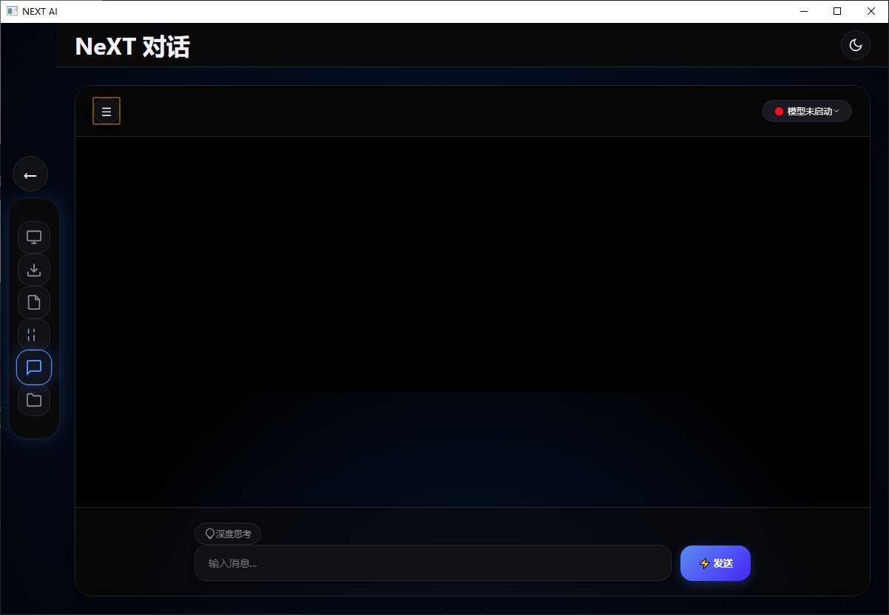
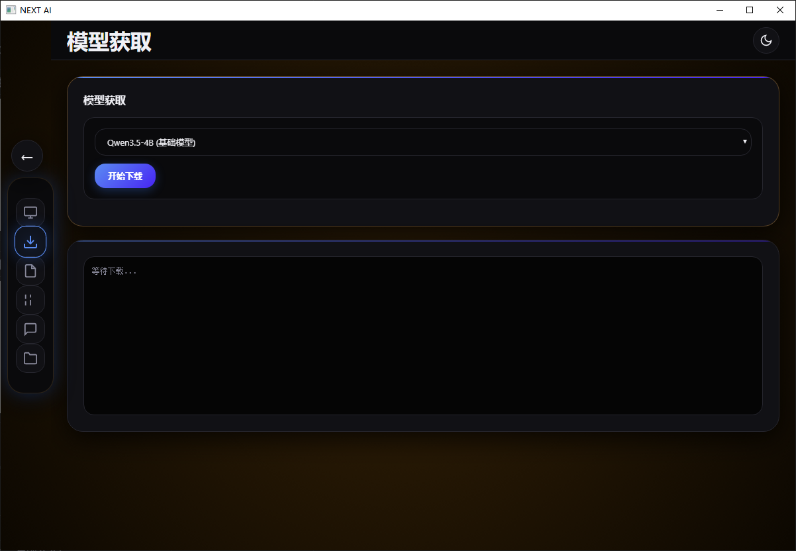
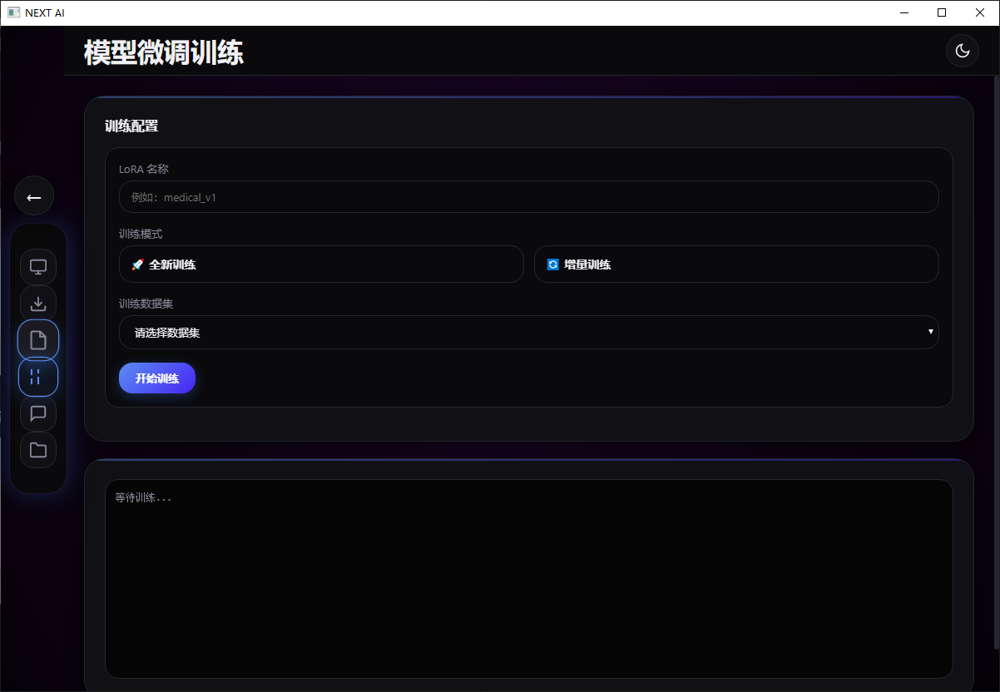
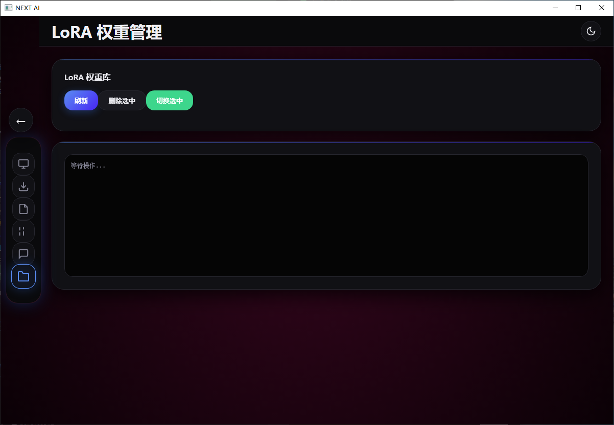

<p align="center">
  
</p>

<h1 align="center">NeXT-Local</h1>

<p align="center">
  <strong>本地 AI 桌面工作台 —— 推理 · 微调 · 管理，双击即用</strong>
</p>

<p align="center">
  无需命令行，无需折腾环境，在 Windows 桌面上轻松运行和微调大语言模型。
</p>

<p align="center">
  <a href="#-快速开始"></a>
  <a href="#-功能特性"></a>
  <a href="LICENSE"></a>
  <a href="https://gitee.com/geforce256/NeXT-Local/stargazers"></a>
</p>

---

## 为什么做这个项目？

现在想在本地跑一个大模型，主流方案要么让你面对一屏命令行，要么下载十几 GB 的"懒人整合包"。对于非技术背景的用户、在校学生、或是只想快速试用本地 AI 的人来说，门槛太高了。

NeXT-Local 的目标很简单：**让本地部署大模型像安装一个普通桌面软件一样简单。** 双击打开，选择模型，开始对话 —— 不需要理解 Docker、Conda、CUDA 这些概念也能上手。

---

## 🎬 界面预览

| 主界面 — 智能对话 | 模型管理 — 一键下载 |
|:---:|:---:|
|  |  |

| 微调训练 — 可视化配置 | LoRA 管理 — 权重库 |
|:---:|:---:|
|  |  |

🎥 **[观看 2 分钟演示视频](docs/assets/demo.mp4)** — 从下载到对话，完整流程一览。

---

## ⚙️ 功能特性

| 能力 | 说明 |
|---|---|
| 🖥️ 一键启动本地大模型 | 双击运行，图形化对话界面，告别命令行 |
| 📦 模型下载与管理一体化 | 内置下载器，支持断点续传 + 自动重试，下载完即可使用 |
| 🔧 可视化 LoRA 微调 | 选择数据集 → 配置参数 → 开始训练，全程图形化操作 |
| 🔄 AI 工作流 / 管线整合 | 串联多个模型和工具，构建自动化 AI 处理流程 |
| 🛡️ 进程隔离架构 | UI 与推理后端独立运行，模型崩溃不会导致界面卡死 |
| 🪶 轻量安装包 | 主程序仅几十 MB，不捆绑冗余依赖 |
| 🌡️ 趣味交互设计 | Temperature 参数与界面背景色动态联动，不同场景不同氛围 |

---

## 🚀 快速开始

### 方式一：下载预编译版本（推荐）

1. 前往 [Releases 页面](../../releases) 下载最新版安装包
2. 双击安装，桌面会出现 NeXT-Local 图标
3. 打开软件 → 选择一个模型 → 开始对话

> 💡 首次使用推荐下载 **Qwen2.5-7B-Instruct** 或 **Llama-3-8B**，效果与速度较为均衡。

### 方式二：从源码运行

```bash
# 1. 克隆仓库
git clone https://gitee.com/geforce256/NeXT-Local.git
cd NeXT-Local

# 2. 安装依赖
pip install -r requirements.txt

# 3. 启动推理后端
python 推理.py

# 4. 启动桌面界面（新终端窗口）
python 主程序入口.py
```

> ⚠️ 需要 Python 3.10+，建议在有 NVIDIA GPU 的环境运行以获得最佳体验。

---

## 🧱 系统架构

NeXT-Local 采用分层架构，各层独立运行，通过本地 API 通信：

```
┌─────────────────────────────────────────────┐
│                  桌面界面层                    │
│        PyQt + WebEngine 图形化前端            │
│    （对话界面 · 模型管理 · 微调面板 · 工作流）   │
└──────────────────┬──────────────────────────┘
                   │  本地 HTTP API
┌──────────────────▼──────────────────────────┐
│                  推理服务层                    │
│         模型加载 · 推理 · LoRA 微调           │
│        （独立进程，崩溃不影响 UI）             │
└──────────────────┬──────────────────────────┘
                   │
┌──────────────────▼──────────────────────────┐
│                  存储层                       │
│       模型文件 · 训练数据 · 配置 · 日志        │
└─────────────────────────────────────────────┘
```

这种设计的好处：模型加载慢或显存溢出时，界面依然流畅响应；推理后端可以独立重启，无需关闭整个程序。

---

## 📋 硬件需求

| 场景 | 最低配置 | 推荐配置 |
|---|---|---|
| 7B 模型对话 | 8 GB 显存 (GPU) 或 16 GB 内存 (CPU) | 12 GB 显存 GPU |
| 13B 模型对话 | 12 GB 显存 | 16+ GB 显存 |
| LoRA 微调 (7B) | 12 GB 显存 | 16+ GB 显存 |

> 没有独立 GPU 也能用 —— 详见 [FAQ](#-faq)。

---

## ❓ FAQ

**Q：没有 GPU 能用吗？**

可以。NeXT-Local 支持 CPU 推理模式，只是生成速度会慢一些。7B 模型在 16 GB 内存的机器上可以正常运行。

**Q：适合笔记本吗？**

适合。16 GB 内存的笔记本可以流畅运行 7B 模型。微调功能建议在有独显的机器上使用。

**Q：和 Ollama / LM Studio 有什么区别？**

Ollama 和 LM Studio 都是优秀的工具。NeXT-Local 的区别在于：内置了 LoRA 微调功能，并且面向中文用户做了交互优化，同时支持 AI 工作流管线编排 —— 不只是对话，还能串联多个模型完成复杂任务。

**Q：是否免费？**

完全免费且开源。NeXT-Local 本身不收费，你可以自由使用、修改和分发。

**Q：支持哪些模型？**

支持 Hugging Face 上的主流开源模型（GGUF / Safetensors 格式），包括 Qwen、Llama、ChatGLM、Yi 等系列。

**Q：数据会上传到云端吗？**

不会。所有推理和微调均在本地完成，模型文件和数据保留在你的电脑上。

---

## 🤝 参与贡献

欢迎提交 Issue 反馈问题，或提交 Pull Request 参与开发。

贡献方向参考：更多模型格式支持、UI 主题与国际化、微调数据集模板、性能优化与 Benchmark、文档与教程完善。

---

## 📜 许可证

本项目采用 [MIT License](LICENSE) 开源。
